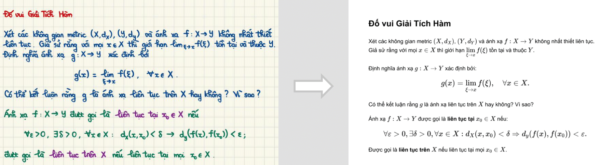

# SuyOCR: Scalable universal yielding OCR

## Overview

SuyOCR is an advanced Optical Character Recognition (OCR) model designed and trained with a primary focus on accurately recognizing Vietnamese and English text. Beyond that, we are ambitiously working to expand its capabilities to support additional languages in the future. Our team is currently optimizing the model through distillation techniques, creating lightweight versions that run efficiently even on CPUs to meet personalized user needs. 

We are excited to announce that the inference code, training code, and model checkpoints will be released in the near future.

## Release Information

- **Training Code**: Coming soon 
- **Inference Code**: Coming soon  
- **Model Weights**: Coming soon  

## Demo Content

Below are some demo images showcasing SuyOCR's capabilities across various use cases:

- **PDF Documents**  
    

- **Scanned Documents**  
    

- **Photos Captured by Smart Devices (e.g., smartphones)**  
    

- **Handwritten Text**  
  

We sincerely thank you for your interest in SuyOCR. Our team is eager to share this project with the community and looks forward to your support in the near future.